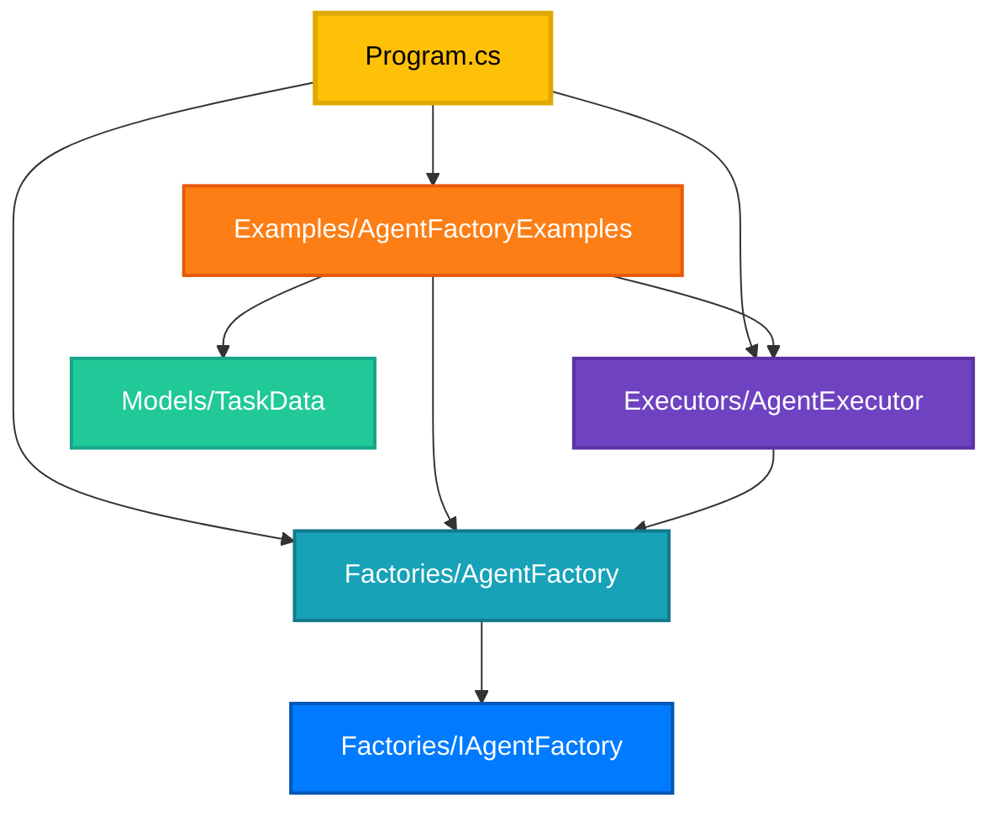

# TaskClassifierWorkflow - Project Structure

This document provides a comprehensive overview of the improved project structure.

## ?? Directory Structure Diagram

```
TaskClassifierWorkflow/
?
??? ?? Factories/                          [Agent Factory Implementations]
?   ??? ?? IAgentFactory.cs               Interface for agent creation
?   ?   ??? Methods: CreateAgent(), CreateAgentWithTools()
?   ?
?   ??? ?? AgentFactory.cs                Concrete factory implementation
?       ??? Features: Caching, Validation, Error Handling
?       ??? Dependencies: IChatClient
?       ??? Methods: CreateAgent(), CreateAgentWithTools(), ClearCache()
?
??? ?? Executors/                          [Workflow Executor Implementations]
?   ??? ?? AgentExecutor<TInput,TOutput>.cs   Generic AI agent executor
?       ??? Features: Input/Output Converters, Type Safety
?       ??? Dependencies: AIAgent, IWorkflowContext
?       ??? Methods: HandleAsync()
?
??? ?? Models/                             [Data Models & DTOs]
?   ??? ?? TaskData.cs                    Task data record
?       ??? Properties: Title, Description
?
??? ?? Examples/                           [Usage Examples & Demos]
?   ??? ?? AgentFactoryExamples.cs        Comprehensive examples
?       ??? BasicClassificationWorkflowExample()
?       ??? CustomConvertersExample()
?       ??? AgentWithToolsExample()
?       ??? MultiStageWorkflowExample()
?       ??? FactoryBenefitsExample()
?
??? ?? Documentation/                      [Project Documentation]
?   ??? ?? AGENT_FACTORY_README.md        Factory pattern guide
?   ??? ?? WORKFLOW_ACTIVITY_DIAGRAM.md   Activity diagrams
?   ??? ?? PROJECT_STRUCTURE.md           This file
?
??? ?? Program.cs                          Application Entry Point
?   ??? Configuration Loading
?   ??? Client Initialization
?   ??? Factory Creation
?   ??? Workflow Execution
?   ??? Event Logging
?
??? ?? README.md                           Project Overview
??? ?? appsettings.json                    Configuration File
??? ?? TaskClassifierWorkflow.csproj       Project File
```

## ??? Namespace Organization

```
TaskClassifierWorkflow                      (Root namespace)
?
??? TaskClassifierWorkflow.Factories        (Factory implementations)
?   ??? IAgentFactory
?   ??? AgentFactory
?
??? TaskClassifierWorkflow.Executors        (Executor implementations)
?   ??? AgentExecutor<TInput, TOutput>
?
??? TaskClassifierWorkflow.Models           (Data models)
?   ??? TaskData
?
??? TaskClassifierWorkflow.Examples         (Example code)
    ??? AgentFactoryExamples
    ??? MockAgentFactory
```

## ?? File Responsibilities

### **Factories/** 
**Purpose**: Centralized creation and management of AI agents

| File | Responsibility | Key Features |
|------|---------------|--------------|
| `IAgentFactory.cs` | Factory interface | Abstraction, Testability |
| `AgentFactory.cs` | Factory implementation | Caching, Validation, Error handling |

### **Executors/**
**Purpose**: Integration of AI agents into workflow pipelines

| File | Responsibility | Key Features |
|------|---------------|--------------|
| `AgentExecutor.cs` | Generic executor wrapper | Type-safe, Converters, Error handling |

### **Models/**
**Purpose**: Data structures and domain objects

| File | Responsibility | Key Features |
|------|---------------|--------------|
| `TaskData.cs` | Task representation | Immutable, Simple, Record type |

### **Examples/**
**Purpose**: Demonstrations and usage patterns

| File | Responsibility | Key Features |
|------|---------------|--------------|
| `AgentFactoryExamples.cs` | Usage examples | Comprehensive, Educational, Best practices |

### **Documentation/**
**Purpose**: Project documentation and diagrams

| File | Responsibility | Key Features |
|------|---------------|--------------|
| `AGENT_FACTORY_README.md` | Factory pattern docs | Detailed, Examples, Best practices |
| `WORKFLOW_ACTIVITY_DIAGRAM.md` | Visual diagrams | Mermaid diagrams, Colorful, Comprehensive |

## ?? Dependency Graph



## ?? Design Principles Applied

### **1. Separation of Concerns**
- Each folder has a single, well-defined responsibility
- Clear boundaries between factories, executors, and models
- Examples separated from production code

### **2. Single Responsibility Principle**
- Each class has one reason to change
- Factory only creates agents
- Executor only executes workflows
- Models only hold data

### **3. Dependency Inversion**
- Program depends on `IAgentFactory` interface, not concrete implementation
- Easy to swap implementations
- Testable with mocks

### **4. Open/Closed Principle**
- Open for extension (new executor types)
- Closed for modification (core factory logic stable)

### **5. Convention over Configuration**
- Namespaces match folder structure
- Consistent naming conventions
- Predictable file locations

## ?? Benefits of This Structure

### **For Developers**
? **Easy Navigation** - Logical folder structure  
? **Clear Responsibilities** - Know where to find/add code  
? **Better IntelliSense** - Organized namespaces  
? **Reduced Merge Conflicts** - Separated concerns  

### **For Maintainers**
? **Easier Debugging** - Clear separation of concerns  
? **Simpler Testing** - Isolated components  
? **Better Documentation** - Organized by purpose  
? **Faster Onboarding** - Self-documenting structure  

### **For the Codebase**
? **Scalability** - Easy to add new components  
? **Modularity** - Components can be moved/reused  
? **Consistency** - Standard patterns throughout  
? **Maintainability** - Clear, organized code  

## ?? Naming Conventions

### **Folders**
- Plural nouns (Factories, Executors, Models, Examples)
- PascalCase naming
- Descriptive of contents

### **Files**
- Match primary class name
- PascalCase naming
- Single class per file (with exceptions for related types)

### **Namespaces**
- Match folder structure
- Format: `TaskClassifierWorkflow.{FolderName}`
- No nested namespaces within folders

## ?? Migration Guide

If you're migrating from the old flat structure:

### **Old Structure**
```
TaskClassifierWorkflow/
??? IAgentFactory.cs
??? AgentFactory.cs
??? AgentExecutor.cs
??? Examples/
    ??? AgentFactoryExamples.cs
```

### **New Structure**
```
TaskClassifierWorkflow/
??? Factories/
?   ??? IAgentFactory.cs
?   ??? AgentFactory.cs
??? Executors/
?   ??? AgentExecutor.cs
??? Models/
?   ??? TaskData.cs
??? Examples/
    ??? AgentFactoryExamples.cs
```

### **Required Changes**
1. ? Update `using` statements to include new namespaces
2. ? Update namespace declarations in moved files
3. ? Rebuild project to verify changes
4. ? Update documentation references

## ?? Future Extensibility

The structure is designed to easily accommodate:

### **New Factories**
```
Factories/
??? IAgentFactory.cs
??? AgentFactory.cs
??? CachedAgentFactory.cs      [NEW]
??? DistributedAgentFactory.cs [NEW]
```

### **New Executors**
```
Executors/
??? AgentExecutor.cs
??? ParallelAgentExecutor.cs   [NEW]
??? RetryableAgentExecutor.cs  [NEW]
```

### **New Models**
```
Models/
??? TaskData.cs
??? WorkflowResult.cs           [NEW]
??? AgentConfiguration.cs       [NEW]
```

## ?? Statistics

| Category | Count | Percentage |
|----------|-------|------------|
| Factory Classes | 2 | 22% |
| Executor Classes | 1 | 11% |
| Model Classes | 1 | 11% |
| Example Classes | 2 | 22% |
| Documentation Files | 3 | 33% |
| **Total** | **9** | **100%** |

## ?? Visual Structure

```
???????????????????????????????????????????????????????????????
?                  TaskClassifierWorkflow                      ?
?                     (Root Project)                           ?
???????????????????????????????????????????????????????????????
         ?
         ???? ?? Factories (Agent Creation)
         ?         ??? IAgentFactory (Interface)
         ?         ??? AgentFactory (Implementation)
         ?
         ???? ?? Executors (Workflow Integration)
         ?         ??? AgentExecutor (Generic Wrapper)
         ?
         ???? ?? Models (Data Structures)
         ?         ??? TaskData (Record Type)
         ?
         ???? ?? Examples (Demonstrations)
         ?         ??? AgentFactoryExamples (5 Examples)
         ?
         ???? ?? Documentation (Project Docs)
         ?         ??? AGENT_FACTORY_README.md
         ?         ??? WORKFLOW_ACTIVITY_DIAGRAM.md
         ?         ??? PROJECT_STRUCTURE.md
         ?
         ???? ?? Program.cs (Entry Point)
```

---

*Project Structure Documentation - TaskClassifierWorkflow - .NET 10*
