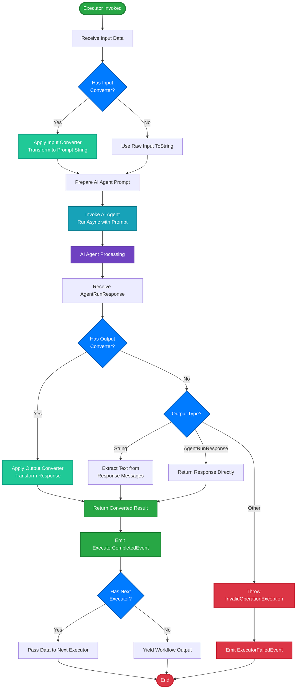
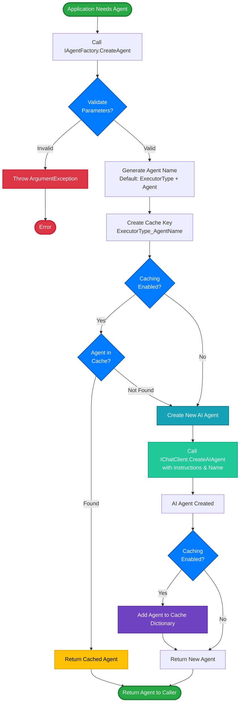
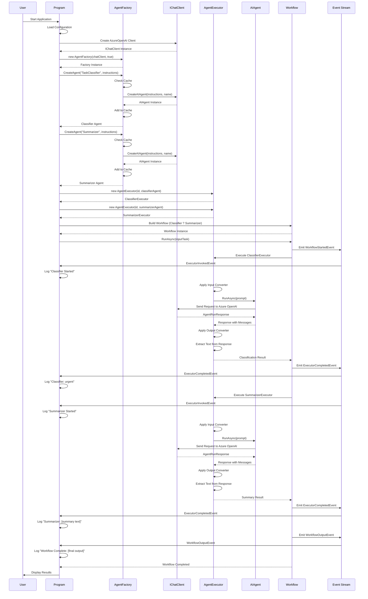
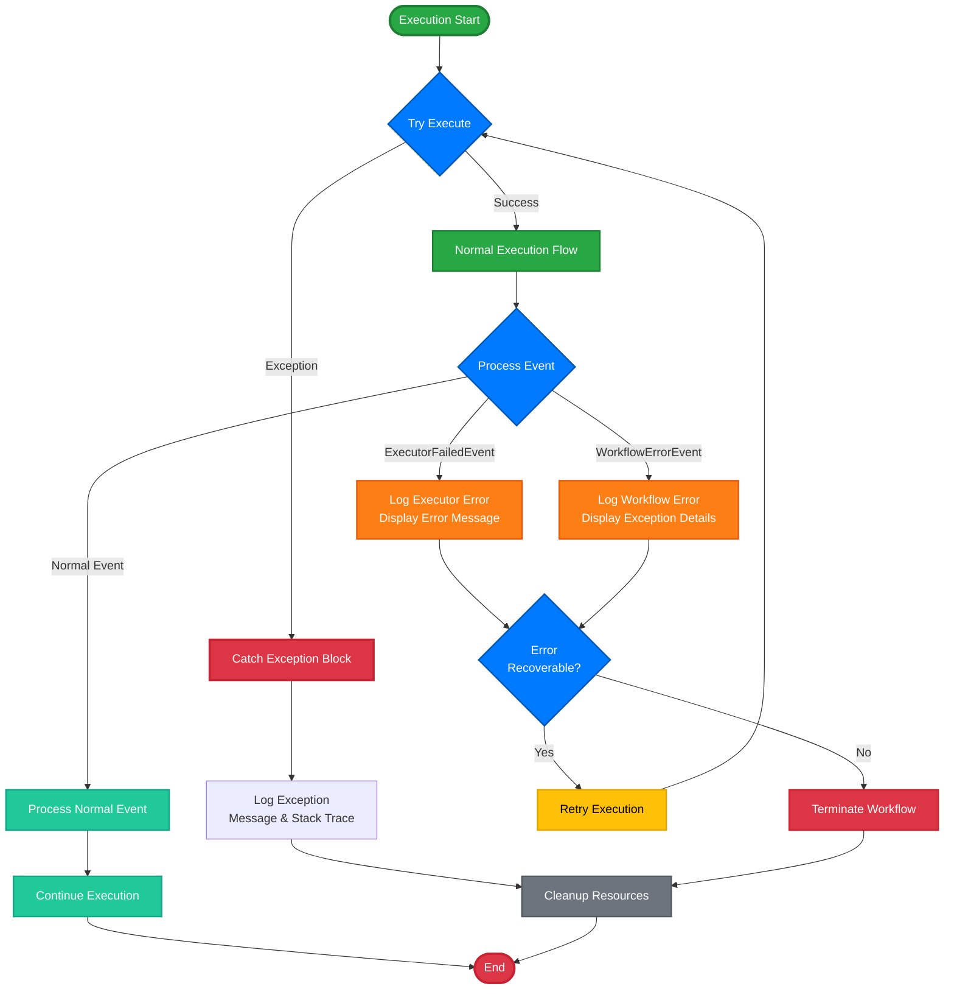

# Agent Factory Workflow - Activity Diagram

This document contains activity diagrams for the Agent Factory workflow implementation in the TaskClassifierWorkflow project.

## Main Workflow Activity Diagram

```mermaid
graph TD
    Start([Start]) --> LoadConfig[Load Configuration<br/>from appsettings.json]
    LoadConfig --> CreateClient[Create Azure OpenAI Client<br/>with Endpoint & API Key]
    CreateClient --> ConvertClient[Convert to IChatClient<br/>using AsIChatClient]
    ConvertClient --> CreateFactory[Create AgentFactory<br/>with Caching Enabled]
    
    CreateFactory --> CreateAgents{Create AI Agents<br/>via Factory}
    
    CreateAgents --> Agent1[Create TaskClassifier Agent<br/>Instructions: Classify tasks]
    CreateAgents --> Agent2[Create Summarizer Agent<br/>Instructions: Summarize text]
    CreateAgents --> Agent3[Create SentimentAnalyzer Agent<br/>Instructions: Analyze sentiment]
    
    Agent1 --> CheckCache1{Agent in Cache?}
    CheckCache1 -->|Yes| ReturnCached1[Return Cached Agent]
    CheckCache1 -->|No| CreateNew1[Create New Agent]
    CreateNew1 --> Cache1[Cache Agent]
    Cache1 --> ReturnCached1
    
    Agent2 --> CheckCache2{Agent in Cache?}
    CheckCache2 -->|Yes| ReturnCached2[Return Cached Agent]
    CheckCache2 -->|No| CreateNew2[Create New Agent]
    CreateNew2 --> Cache2[Cache Agent]
    Cache2 --> ReturnCached2
    
    Agent3 --> CheckCache3{Agent in Cache?}
    CheckCache3 -->|Yes| ReturnCached3[Return Cached Agent]
    CheckCache3 -->|No| CreateNew3[Create New Agent]
    CreateNew3 --> Cache3[Cache Agent]
    Cache3 --> ReturnCached3
    
    ReturnCached1 --> CreateExecutors[Create AgentExecutors<br/>Wrapper Classes]
    ReturnCached2 --> CreateExecutors
    ReturnCached3 --> CreateExecutors
    
    CreateExecutors --> Executor1[ClassifierExecutor<br/>Input Converter: Add prompt<br/>Output Converter: Extract text]
    CreateExecutors --> Executor2[SummarizerExecutor<br/>Input Converter: Add prompt<br/>Output Converter: Extract text]
    
    Executor1 --> BuildWorkflow[Build Workflow<br/>using WorkflowBuilder]
    Executor2 --> BuildWorkflow
    
    BuildWorkflow --> AddEdges[Add Edge:<br/>Classifier ? Summarizer]
    AddEdges --> SetOutput[Set Output From:<br/>Summarizer]
    SetOutput --> WorkflowReady[Workflow Ready]
    
    WorkflowReady --> ExecuteWorkflow[Execute Workflow<br/>Input: Task Description]
    
    ExecuteWorkflow --> WatchEvents{Process Workflow Events}
    
    WatchEvents --> EventInvoked[ExecutorInvokedEvent<br/>Log: Executor Started]
    WatchEvents --> EventCompleted[ExecutorCompletedEvent<br/>Log: Executor Result]
    WatchEvents --> EventFailed[ExecutorFailedEvent<br/>Log: Error Details]
    WatchEvents --> EventOutput[WorkflowOutputEvent<br/>Log: Final Result]
    WatchEvents --> EventError[WorkflowErrorEvent<br/>Log: Workflow Error]
    
    EventInvoked --> WatchEvents
    EventCompleted --> WatchEvents
    EventFailed --> HandleError[Handle Error]
    EventOutput --> Complete[Workflow Complete]
    EventError --> HandleError
    
    HandleError --> End([End])
    Complete --> End
    
    style Start fill:#28a745,stroke:#1e7e34,stroke-width:3px,color:#fff
    style End fill:#dc3545,stroke:#c82333,stroke-width:3px,color:#fff
    style CreateFactory fill:#17a2b8,stroke:#117a8b,stroke-width:2px,color:#fff
    style BuildWorkflow fill:#6f42c1,stroke:#5a32a3,stroke-width:2px,color:#fff
    style ExecuteWorkflow fill:#ffc107,stroke:#e0a800,stroke-width:2px,color:#000
    style Complete fill:#28a745,stroke:#1e7e34,stroke-width:3px,color:#fff
    style HandleError fill:#dc3545,stroke:#c82333,stroke-width:3px,color:#fff
    style CreateAgents fill:#fd7e14,stroke:#e8590c,stroke-width:2px,color:#fff
    style WatchEvents fill:#007bff,stroke:#0056b3,stroke-width:2px,color:#fff
    style Agent1 fill:#20c997,stroke:#17a589,stroke-width:2px,color:#fff
    style Agent2 fill:#20c997,stroke:#17a589,stroke-width:2px,color:#fff
    style Agent3 fill:#20c997,stroke:#17a589,stroke-width:2px,color:#fff
    style CheckCache1 fill:#007bff,stroke:#0056b3,stroke-width:2px,color:#fff
    style CheckCache2 fill:#007bff,stroke:#0056b3,stroke-width:2px,color:#fff
    style CheckCache3 fill:#007bff,stroke:#0056b3,stroke-width:2px,color:#fff
    style EventCompleted fill:#28a745,stroke:#1e7e34,stroke-width:2px,color:#fff
    style EventFailed fill:#dc3545,stroke:#c82333,stroke-width:2px,color:#fff
    style EventError fill:#dc3545,stroke:#c82333,stroke-width:2px,color:#fff
```

## Detailed Executor Execution Flow

## Agent Factory Pattern Flow

## Complete Workflow Execution Sequence

## Error Handling Flow

## Key Components

### 1. Agent Factory
- **Purpose**: Centralized agent creation with caching
- **Inputs**: Executor type, instructions, name (optional)
- **Outputs**: Configured AIAgent instance
- **Features**: Validation, caching, error handling

### 2. Agent Executor
- **Purpose**: Wrapper to integrate AI agents into workflows
- **Inputs**: Generic TInput data
- **Outputs**: Generic TOutput data
- **Features**: Input/output converters, agent invocation, error handling

### 3. Workflow
- **Purpose**: Orchestrate multiple executors in sequence
- **Inputs**: Initial task data
- **Outputs**: Final processed result
- **Features**: Event streaming, error propagation, sequential execution

### 4. Event System
- **ExecutorInvokedEvent**: Executor starts processing
- **ExecutorCompletedEvent**: Executor finishes successfully
- **ExecutorFailedEvent**: Executor encounters error
- **WorkflowOutputEvent**: Workflow produces final output
- **WorkflowErrorEvent**: Workflow encounters error

## Workflow Characteristics

- **Sequential Processing**: Classifier ? Summarizer
- **AI-Powered**: Uses Azure OpenAI for intelligent processing
- **Event-Driven**: Real-time event streaming for monitoring
- **Error-Resilient**: Comprehensive error handling and logging
- **Cached Agents**: Performance optimization through agent reuse
- **Flexible Design**: Easy to add more executors and agents

## Color Legend

| Color | Purpose | Usage |
|-------|---------|-------|
| ?? Green (#28a745) | Success/Start/Complete | Start nodes, successful completions, normal flow |
| ?? Red (#dc3545) | Error/Failure/End | Error states, exceptions, failures, end nodes |
| ?? Blue (#007bff) | Decision Points | All decision diamonds, conditional logic |
| ?? Cyan (#17a2b8) | Processing | Agent invocation, client calls, main processing |
| ?? Purple (#6f42c1) | Data Operations | Caching, data transformation, persistence |
| ?? Yellow (#ffc107) | Important Actions | Key operations, cached retrievals, warnings |
| ?? Orange (#fd7e14) | Warnings/Alerts | Error logging, warning states, attention needed |
| ?? Teal (#20c997) | Conversion/Transform | Converters, transformations, data mapping |
| ? Gray (#6c757d) | Cleanup/Utility | Resource cleanup, utility operations |

---

*Generated for TaskClassifierWorkflow project - .NET 10*
